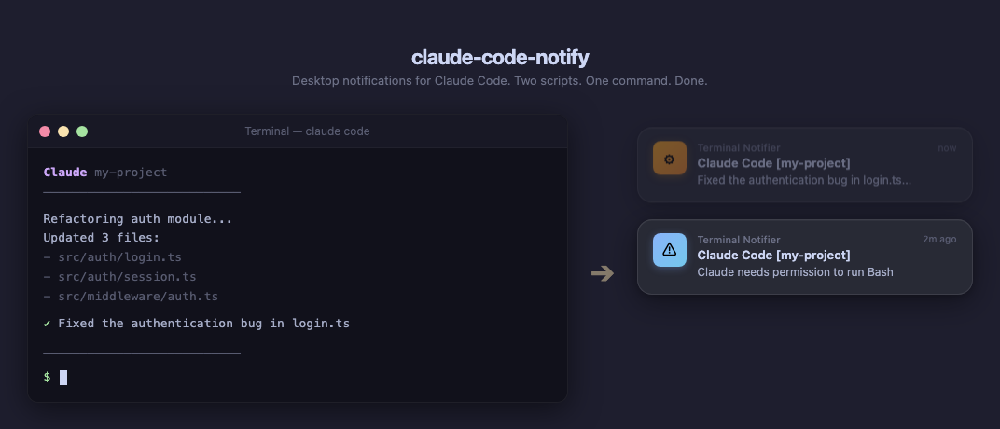

<h1 align="center">claude-code-notify</h1>
<p align="center"><strong>Desktop notifications for Claude Code. Two scripts. One command. Done.</strong></p>
<p align="center">
  
  
  
  
  
</p>

<p align="center">🌏 <strong>English</strong> | <a href="README.ko.md">한국어</a></p>

<p align="center">
  
</p>

## Quick install

```bash
# Install terminal-notifier (recommended, macOS)
brew install terminal-notifier

# Install hooks — that's it
curl -fsSL https://raw.githubusercontent.com/JadenChoi2k/claude-code-notify/main/install.sh | bash
```

Restart Claude Code. You're done.

## What you get

- **Response complete** (`Stop` hook) — System sound + notification with response summary
- **Input needed** (`Notification` hook) — System sound + notification when Claude needs permission
- **Project context** — Every notification shows the current project name
- **Clickable notifications** — Click to jump back to your terminal (via [terminal-notifier](https://github.com/julienXX/terminal-notifier))
- **Notification grouping** — No spam; new notifications replace previous ones per category
- **Graceful fallback** — Falls back to `osascript` if terminal-notifier is not installed
- Works with **macOS** and **Linux**

Example notifications:

> **Claude Code [my-project]** — _Fixed the authentication bug in login.ts..._

> **Claude Code [my-project]** — _Claude needs permission to run Bash_

## Why this one?

| | claude-code-notify | claude-notifications-go | CCNotify |
|---|---|---|---|
| Install | `curl \| bash` | Download binary | VS Code only |
| Dependencies | None (bash + python3) | Go binary (~8 MB) | VS Code extension |
| Click to focus | Yes | No | Yes (VS Code) |
| Notification grouping | Yes | No | N/A |
| Total size | ~3 KB | ~8 MB | Extension |

## Manual install

1. Copy scripts to `~/.claude/scripts/`:

```bash
mkdir -p ~/.claude/scripts
cp notify.sh notify-prompt.sh ~/.claude/scripts/
chmod +x ~/.claude/scripts/notify.sh ~/.claude/scripts/notify-prompt.sh
```

2. Add hooks to `~/.claude/settings.json`:

```json
{
  "hooks": {
    "Stop": [
      {
        "hooks": [
          {
            "type": "command",
            "command": "~/.claude/scripts/notify.sh"
          }
        ]
      }
    ],
    "Notification": [
      {
        "matcher": "permission_prompt|elicitation_dialog",
        "hooks": [
          {
            "type": "command",
            "command": "~/.claude/scripts/notify-prompt.sh"
          }
        ]
      }
    ]
  }
}
```

3. Restart Claude Code.

## Uninstall

```bash
curl -fsSL https://raw.githubusercontent.com/JadenChoi2k/claude-code-notify/main/uninstall.sh | bash
```

Or manually:
```bash
rm ~/.claude/scripts/notify.sh ~/.claude/scripts/notify-prompt.sh
# Then remove the "Stop" and "Notification" hooks from ~/.claude/settings.json
```

## How it works

### `notify.sh` — Stop hook

Fires every time Claude finishes responding. Receives a JSON payload on stdin:

| Field | Description |
|---|---|
| `cwd` | Current working directory |
| `last_assistant_message` | Claude's last response text |
| `session_id` | Session identifier |

Shows the project name (from `cwd`) and a truncated summary of the last response.

### `notify-prompt.sh` — Notification hook

Fires when Claude needs user input. Matches `permission_prompt` and `elicitation_dialog` events. Receives:

| Field | Description |
|---|---|
| `cwd` | Current working directory |
| `notification_type` | Type of notification |
| `message` | Description of what Claude needs |

Uses a separate notification group to distinguish from completion notifications.

## Customization

### Sound

Both scripts use `-sound default` (system notification sound). To change it:

```bash
# Use a specific macOS sound
terminal-notifier ... -sound Glass

# Available: Basso, Blow, Bottle, Frog, Funk, Glass, Hero, Morse, Ping, Pop, Purr, Sosumi, Submarine, Tink
```

### Terminal app activation

By default, clicking a notification activates Terminal.app. To change this (e.g., for iTerm2), edit the `-activate` flag:

```bash
# iTerm2
terminal-notifier ... -activate "com.googlecode.iterm2"

# Ghostty
terminal-notifier ... -activate "com.mitchellh.ghostty"

# Kitty
terminal-notifier ... -activate "net.kovidgoyal.kitty"
```

## Known limitations

- **Notification hook delay**: The `Notification` hook may have a 1-10 second delay. The `Stop` hook fires instantly.
- **VS Code**: Notification hooks may not fire in the VS Code extension ([#11156](https://github.com/anthropics/claude-code/issues/11156)). The Stop hook works.
- **idle_prompt**: The `idle_prompt` notification has a hardcoded 60-second timeout before firing.

## Requirements

- **macOS**: [terminal-notifier](https://github.com/julienXX/terminal-notifier) (recommended) or built-in `osascript`
- **Linux**: `notify-send` (usually pre-installed) and optionally `pulseaudio-utils` for sound
- **Python 3**: Used to parse JSON payload (pre-installed on most systems)

## Roadmap

- [ ] Auto-detect terminal app (Ghostty, iTerm2, Kitty)
- [ ] Elapsed time in completion notification
- [ ] Do Not Disturb awareness (macOS)
- [ ] Custom sound via environment variable
- [ ] WSL support

## Contributing

See [CONTRIBUTING.md](CONTRIBUTING.md) for guidelines.

## License

[MIT](LICENSE)
